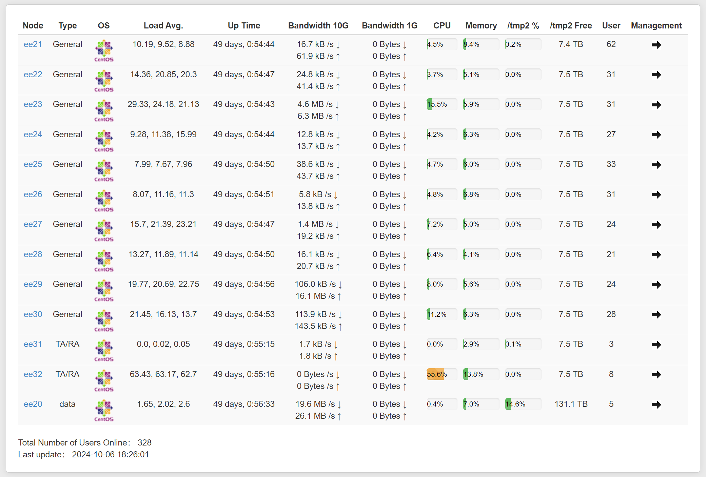
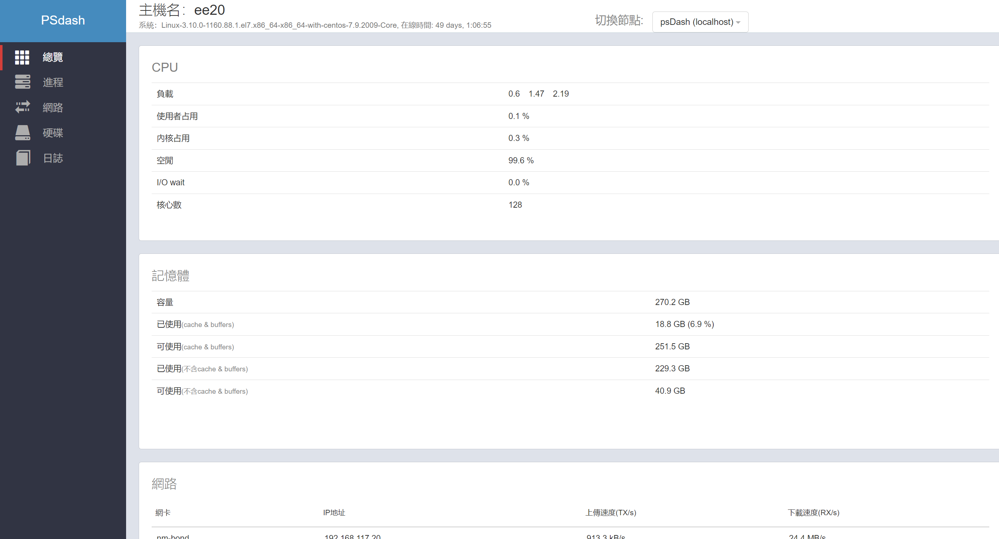
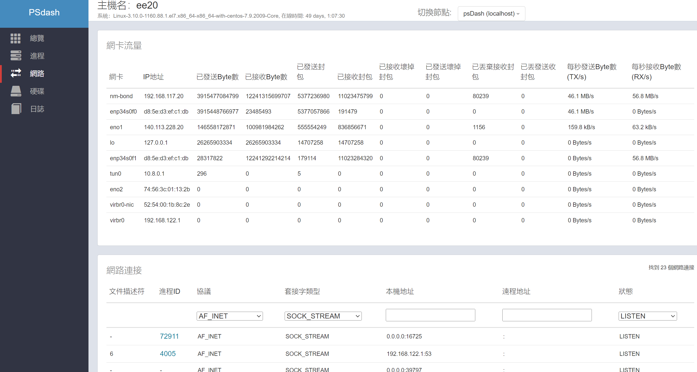
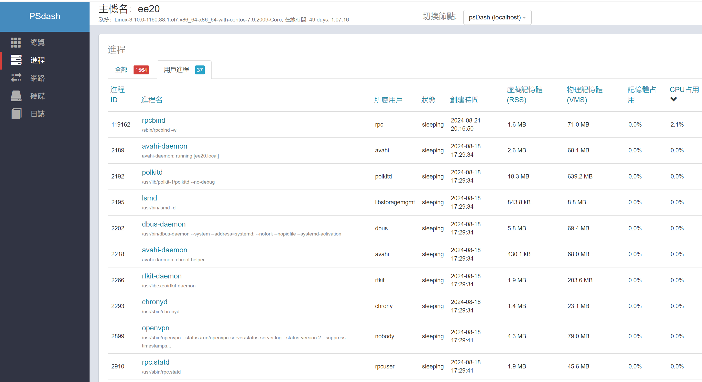
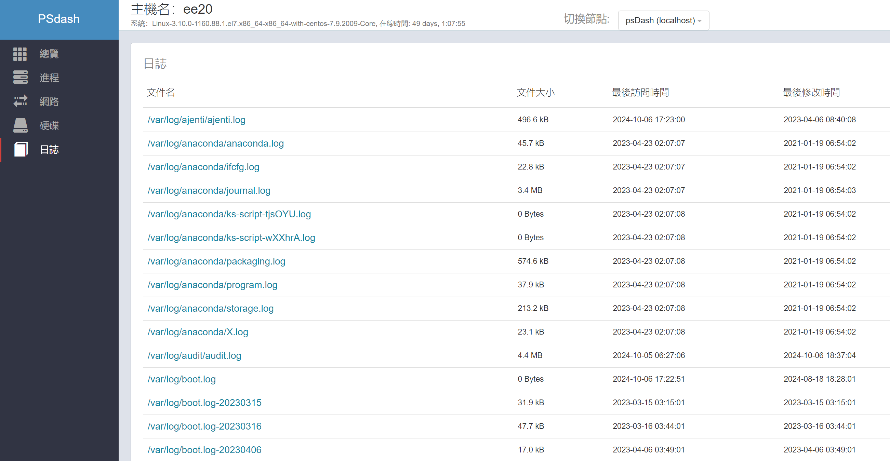

# psdash\_HTTPBasicAuth 繁體中文版

This project originally uses code from [wenguonideshou/psdash_HTTPBasicAuth](https://github.com/wenguonideshou/psdash_HTTPBasicAuth). Special thanks to [wenguonideshou](https://github.com/wenguonideshou) for their contributions.

簡介：在 psdash 的基礎上添加 HTTP 基本身份驗證（即打開頁面會彈出提示框，需要輸入用戶名和密碼），界面翻譯為中文，並增加展示所有節點基本狀態的主界面，可以理解為 psdash 的中文版分支。

功能：psdash 是基於 psutil 和 zerorpc 的 Python 語言開發的主機監控面板，本分支包含 psdash 的所有功能，支持多節點/集群部署，所有數據每 3 秒自動更新，無需手動刷新頁面。

* **總覽頁**：支持查看 CPU、磁碟、網絡、用戶、內存、交換區（swap）、網絡
* **進程**：進程列表，展示每個進程的詳細信息，包括打開的文件數、打開的連接數、內存佔用、子進程、資源限制
* **硬碟**：顯示所有硬碟和分區
* **網絡**：顯示所有網絡接口和使用的流量，以及當前的網絡連接
* **日誌**：展示自定義的日誌文件詳細信息，支持搜索文件內容

## 特色說明
### 1\. **伺服器監控系統總覽**

新增的功能可以顯示每台伺服器的關鍵資源使用情況，具體包括：


* **Node**：顯示每台伺服器的名稱或編號，方便管理和查找，點擊後可以進入 glanses 程式查看。
* **Type**：伺服器類型，例如 `General`、`TA/RA` 或 `Data`，標示伺服器的使用目的或身份。
* **OS**：顯示每台伺服器的操作系統，例如 `CentOS`，讓管理者清楚每台伺服器的運行環境。
* **Load Avg.**：平均負載數據顯示了伺服器的即時處理能力，展示了最近 1 分鐘、5 分鐘和 15 分鐘的負載情況，這些數據可幫助管理者快速掌握伺服器的壓力狀態。
* **Up Time**：伺服器的持續運行時間，顯示已運行多少天和小時，方便檢查伺服器的穩定性和是否需要重啟。
* **Bandwidth 10G / 1G**：可以監控每台伺服器的網絡流量，10G 和 1G 網絡的上行和下行數據以 kB/s 和 MB/s 為單位顯示，幫助分析網絡資源的使用情況。
* **CPU 和 Memory 使用率**：實時顯示每台伺服器的 CPU 和內存使用率，讓管理者能夠快速了解資源負荷，確保系統不會因過載而導致性能下降。
* **/tmp2 磁碟使用情況**：展示了每台伺服器 `/tmp2` 區域的使用率和剩餘容量，這對確保伺服器有足夠的臨時存儲空間至關重要。
* **User**：顯示當前連接到每台伺服器的用戶數，幫助管理者監控伺服器的使用情況，防止單台伺服器超負荷使用。
* **Management**：透過點擊圖標進入每台伺服器的管理界面，方便進一步操作。

### 2\. **總人數與在線人數監控**

* 圖片下方顯示了**總共上線用戶數量**，可以快速了解整體伺服器集群的使用情況。
* **Last update**：每次數據更新的時間顯示，確保管理者知道目前數據的實時性，便於及時反應。

### 3\. **伺服器使用人數變化圖**


* 新功能還可展示近 7 日內伺服器的使用人數變化趨勢圖。這一圖表可以分析每日的尖峰時段，並幫助預測未來的高負載時間，從而使管理者更好地優化資源分配。
* **尖峰分析**：透過變化圖，可以清楚看到伺服器在尖峰時段（例如白天或特定時段）出現的使用人數激增，這有助於提前計劃擴充伺服器資源或調整使用策略。

這些新增功能能夠幫助管理者更好地監控伺服器資源使用情況，並根據流量和使用負載的變化做出及時的資源調整。

## 腳本和使用情境說明

### 01\_run

**功能**：批量啟動 `psdash` 和 `glances`，並將節點註冊到主節點。

```bash
#!/bin/bash

nohup python run.py -l '/var/log/*' -l '/var/log/**/*.log' &
pssh -h someHosts -l root "psdash -a -l '/var/log/*' -l '/var/log/**/*.log' --register-to http://140.113.228.20:5000"
pssh -h someHosts -l root "glances -w"
nohup glances -w &
```

* `nohup python run.py`：啟動 `run.py` 來監控 `/var/log` 目錄下的日誌文件，並使用 `nohup` 保持運行。
* `pssh`：透過 `pssh` 批量在指定節點上運行 `psdash` 和 `glances`，並註冊到主伺服器。

**使用情境**：當需要監控多個伺服器的日誌和系統資源狀況時，執行此腳本會批量啟動監控服務。

### 02\_check\_run

**功能**：檢查 `run.py` 是否正在執行。

```bash
#!/bin/bash
ps -aux | grep "python run.py"
```

* 這個腳本會透過 `ps` 命令檢查是否有與 `run.py` 相關的進程在執行。

**使用情境**：執行此腳本可以確定監控服務是否正常運行。

### 03\_kill

**功能**：停止正在執行的 `run.py` 腳本。

```bash
#!/bin/bash
kill `ps -aux | grep "python run.py" | grep -v grep | awk '{print $2}'`
```

* 使用 `grep` 和 `awk` 獲取進程 ID，然後使用 `kill` 命令來終止進程。

**使用情境**：當需要停止監控服務時，執行此腳本來關閉 `run.py`。

### someHosts

**內容**：定義了多個節點的主機名和連接埠號，供 `pssh` 批量操作使用。

```makefile
ee21:415
ee22:415
ee23:415
ee24:415
ee25:415
ee26:415
ee27:415
ee28:415
ee29:415
ee30:415
ee31:415
ee32:415
```

**使用情境**：`someHosts` 檔案包含需要監控的節點列表，用於批量執行命令，如啟動或停止 `psdash` 和 `glances`。

# 安裝

**1\. 主節點和 agent 節點都執行下面的命令（安裝 psdash）**

Debian/Ubuntu:

```bash
apt-get install build-essential python-dev -y
apt-get install python-setuptools  -y
pip install psdash --allow-external argparse
```

如果上面的命令安裝不成功，則執行以下命令：

```bash
git clone https://github.com/Jahaja/psdash.git
cd psdash
pip install -U setuptools
python setup.py install
```

RHEL (Fedora, CentOS):

```bash
yum groupinstall "Development Tools" -y
yum install python-devel -y
yum install python-setuptools -y
pip install psdash --allow-external argparse
```

如果上面的命令安裝不成功，則執行以下命令：

```bash
git clone https://github.com/Jahaja/psdash.git
cd psdash
pip install -U setuptools
python setup.py install
```

**2\. 主節點執行**

```bash
pip install flask-httpauth
git clone https://github.com/wenguonideshou/psdash_HTTPBasicAuth.git
cd psdash_HTTPBasicAuth
python run.py -l '/var/log/**/*.log'
```

**3\. Agent 節點執行**

```bash
psdash -a --register-as xxx -l '/var/log/**/*.log' --register-to http://主節點IP:5000
```

## 如何修改參數？

在 `run.py` 中 `app = Flask(__name__)` 下面添加如下語句：

```bash
app.config.xxx = yyy
```

例如：

```bash
app.config.PSDASH_ALLOWED_REMOTE_ADDRESSES = "10.0.0.2, 192.29.20.2"
app.config.PSDASH_URL_PREFIX = "/psdash"
app.config.PSDASH_LOG_LEVEL = logging.INFO
app.config.PSDASH_LOG_LEVEL = "%(levelname)s"
app.config.PSDASH_NODES = [{'name': 'mywebnode', 'host': '10.0.0.2', 'port': 5000}]
app.config.PSDASH_NET_IO_COUNTER_INTERVAL = 3
app.config.PSDASH_LOGS_INTERVAL = 60
app.config.PSDASH_REGISTER_INTERVAL = 60
app.config.PSDASH_LOGS = ['/var/log/*.log']
app.config.PSDASH_REGISTER_TO = 'http://10.0.20.2:5000'
app.config.PSDASH_REGISTER_AS = 'myvps'
app.config.PSDASH_HTTPS_KEYFILE = '/home/user/private.key'
app.config.PSDASH_HTTPS_CERTFILE = '/home/user/certificate.crt'
app.config.PSDASH_ENVIRON_WHITELIST = ['HOME']
```

詳細參數說明請參考：[https://github.com/Jahaja/psdash#configuration](https://github.com/Jahaja/psdash#configuration)

**修改用戶名密碼**

修改 `web.py` 中的 `users = {"admin": "admin"}`，前面是用戶名，後面是密碼，可以添加多個用戶。

**修改刷新時間間隔**

修改 `static/js/psdash.js` 中的 3000 數字。

修改 `templates/all.html` 中的 3000 數字。

**卸載**

```bash
pip uninstall psdash
rm -r /root/psdash_HTTPBasicAuth
```





